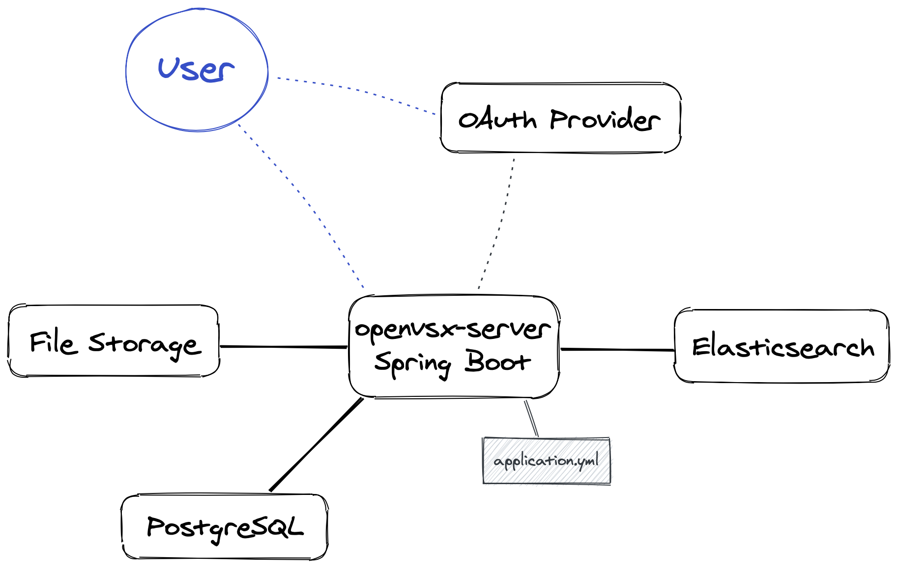

## Architectural Overview



The central element is the server application, which is available in the [openvsx-server](https://github.com/orgs/eclipse/packages/container/package/openvsx-server) Docker image. It is a [Spring Boot](https://spring.io/projects/spring-boot) application and needs an `application.yml` file to [configure the deployment](#configuring-application.yml). Open VSX does not provide any facility to deploy the other components (database, search engine etc.) because there are numerous ways how the infrastructure can be set up. Using Kubernetes is one option, but that is not mandatory.

The database holding all metadata of published extensions is a [PostgreSQL](https://www.postgresql.org) instance. In case no additional file storage is used, all files are stored as binary data in the database. Though this setup is supported by Open VSX, it considerably increases storage and network thoughput of the database, so using an external file storage is recommended. Currently [Azure Blob Storage](https://azure.microsoft.com/services/storage/blobs/) and [Google Cloud Storage](https://cloud.google.com/storage) are supported as external storage providers.

[Elasticsearch](https://www.elastic.co/elasticsearch/) is used as search engine for search queries from the web UI. This component is optional: omitting it disables the search functionality, but all other Open VSX features are still available.

User authentication is done with [OAuth](https://oauth.net). Currently only [GitHub](https://docs.github.com/en/free-pro-team@latest/developers/apps/building-oauth-apps) is supported as OAuth provider.

## Configuring application.yml

The Open VSX server is configured using an `application.yml` file. See the [Spring Boot documentation](https://docs.spring.io/spring-boot/docs/current/reference/html/spring-boot-features.html#boot-features-external-config) for more information on this configuration format.

The server application will automatically load the configuration file if you put it into the directory `/home/openvsx/server/config` of the server image. There are several ways to do this, e.g. you can extend the Docker image or use a Kubernetes ConfigMap.

You can use all configuration properties offered by Spring to set up your deployment. In particular, you need to [configure a datasource](https://docs.spring.io/spring-boot/docs/current/reference/html/spring-boot-features.html#boot-features-connect-to-production-database) to connect the application with the database.

## Open VSX Configuration Properties

This section describes the special configuration properties supported by the Open VSX server.

### Publishing

| Property      | `ovsx.publishing.require-license`
|---------------|-----------------------------------
| Type          | boolean
| Default       | `false`
| Compatibility | Since 0.1

Whether published extensions are required to have a license. If active, unlicensed extensions are rejected.

### Web UI

| Property      | `ovsx.webui.url`
|---------------|------------------
| Type          | string
| Default       | 
| Compatibility | Since 0.1

Base URL of the web UI. This is required only if it's different from the server.

| Property      | `ovsx.webui.frontendRoutes`
|---------------|-----------------------------
| Type          | string[]
| Default       | `/extension/**,/user-settings/**,/admin-dashboard/**`
| Compatibility | Since 0.1

Routes to be forwarded to `/` because they are handled by the frontend.

### Elasticsearch

| Property      | `ovsx.elasticsearch.enabled`
|---------------|------------------------------
| Type          | boolean
| Default       | `true`
| Compatibility | Since 0.1

Whether to enable search functionality. By switching this off, it is not necessary to deploy Elasticsearch, but users will not be able to search extensions.

| Property      | `ovsx.elasticsearch.clear-on-start`
|---------------|-------------------------------------
| Type          | boolean
| Default       | `false`
| Compatibility | Since 0.1

Whether to clear and rebuild the search index on startup. If disabled, the index is built only if it does not exist yet. Rebuilding the search index may take several minutes if there are many extensions.

| Property      | `ovsx.elasticsearch.host`
|---------------|---------------------------
| Type          | string
| Default       | `localhost:9200`
| Compatibility | Since 0.1

Host and port of the Elasticsearch instance.

| Property      | `ovsx.elasticsearch.ssl`
|---------------|--------------------------
| Type          | boolean
| Default       | `false`
| Compatibility | Since 0.1

Whether to connect with SSL.

| Property      | `ovsx.elasticsearch.username`
|---------------|-------------------------------
| Type          | string
| Default       | 
| Compatibility | Since 0.1

Username for basic authentication.

| Property      | `ovsx.elasticsearch.password`
|---------------|-------------------------------
| Type          | string
| Default       | 
| Compatibility | Since 0.1

Password for basic authentication.

| Property      | `ovsx.elasticsearch.truststore`
|---------------|---------------------------------
| Type          | string
| Default       | 
| Compatibility | Since 0.1

Path to a trust store file for SSL connection.

| Property      | `ovsx.elasticsearch.truststoreProtocol`
|---------------|-----------------------------------------
| Type          | string
| Default       | `TLSv1.2`
| Compatibility | Since 0.1

Protocol for SSL connection.

| Property      | `ovsx.elasticsearch.truststorePassword`
|---------------|-----------------------------------------
| Type          | string
| Default       | 
| Compatibility | Since 0.1

Password for trust store file.

| Property      | `ovsx.elasticsearch.relevance.rating`
|---------------|---------------------------------------
| Type          | double
| Default       | `1.0`
| Compatibility | Since 0.1

Weight of user ratings for computing relevance. This has an impact on the order of search results when `sortBy` is set to `relevance`.

| Property      | `ovsx.elasticsearch.relevance.downloads`
|---------------|------------------------------------------
| Type          | double
| Default       | `1.0`
| Compatibility | Since 0.1

Weight of download counts for computing relevance. This has an impact on the order of search results when `sortBy` is set to `relevance`.

| Property      | `ovsx.elasticsearch.relevance.timestamp`
|---------------|------------------------------------------
| Type          | double
| Default       | `1.0`
| Compatibility | Since 0.1

Weight of publishing timestamps for computing relevance (newer extensions are ranked higher). This has an impact on the order of search results when `sortBy` is set to `relevance`.

| Property      | `ovsx.elasticsearch.relevance.public`
|---------------|---------------------------------------
| Type          | double
| Default       | `0.8`
| Compatibility | Since 0.1

Relevance factor for public namespaces. The combined relevance from the `averageRating`, `downloadCount` and `timestamp` criteria is multiplied with this value if the extension's namespace has no owner.

| Property      | `ovsx.elasticsearch.relevance.unrelated`
|---------------|------------------------------------------
| Type          | double
| Default       | `0.5`
| Compatibility | Since 0.1

Relevance factor for unrelated publishers. The combined relevance from the `averageRating`, `downloadCount` and `timestamp` criteria is multiplied with this value if the publisher of the extension is not a member of the extension's namespace.

### File Storage

| Property      | `ovsx.storage.azure.service-endpoint`
|---------------|---------------------------------------
| Type          | string
| Default       | 
| Compatibility | Since 0.1

Azure blob service endpoint URL (without parameters, must end with a slash). This is required in order to enable the Azure storage service. Example: `https://openvsx.blob.core.windows.net/`

| Property      | `ovsx.storage.azure.sas-token`
|---------------|--------------------------------
| Type          | string
| Default       | 
| Compatibility | Since 0.1

The full query string containing the Azure SAS (Shared Access Signature) token.

| Property      | `ovsx.storage.azure.blob-container`
|---------------|-------------------------------------
| Type          | string
| Default       | `openvsx-resources`
| Compatibility | Since 0.1

Name of the Azure blob container.

| Property      | `ovsx.storage.gcp.project-id`
|---------------|-------------------------------
| Type          | string
| Default       | 
| Compatibility | Since 0.1

GCP project id. This can be omitted if the GCP client is able to detect the project from the environment.

| Property      | `ovsx.storage.gcp.bucket-id`
|---------------|------------------------------
| Type          | string
| Default       | 
| Compatibility | Since 0.1

GCP bucket id. This is required in order to enable the Google Cloud storage service. Note that in order to upload files you need to authenticate with the storage service, e.g. by putting service account credentials into a file and pointing the environment variable `GOOGLE_APPLICATION_CREDENTIALS` to that file. Unauthenticated access is possible when migrating from GCP to another storage provider.

| Property      | `ovsx.storage.primary-service`
|---------------|--------------------------------
| Type          | string
| Default       | 
| Compatibility | Since 0.1

Storage service to use if multiple are active (`azure-blob` or `google-cloud`). All files that are not in the primary service are automatically migrated on application startup.

| Property      | `ovsx.storage.external-resource-types`
|---------------|----------------------------------------
| Type          | string[]
| Default       | `*`
| Compatibility | Since 0.1

Resource types to store in an external storage provider, or `*` for all types. Possible values are `download` (i.e. the `vsix` file), `manifest`, `icon`, `readme`, `license` and `changelog`. If only a subset of those types is chosen, the remaining types are stored as byte arrays in the database.

| Property      | `ovsx.storage.migration-delay`
|---------------|--------------------------------
| Type          | long
| Default       | `500`
| Compatibility | Since 0.1

Delay in milliseconds between storage type migration of each file. This delay is important to avoid excessive load in the server application, since migration is performed by the server itself on startup. Longer delays decrease server load, but increase the total duration of file migration.

### Upstream Registry

| Property      | `ovsx.upstream.url`
|---------------|---------------------
| Type          | string
| Default       | 
| Compatibility | Since 0.1

Base URL of the [upstream registry instance](#upstream-registry-instance).

### VS Code

| Property      | `ovsx.vscode.upstream.gallery-url`
|---------------|------------------------------------
| Type          | string
| Default       | 
| Compatibility | Since 0.1

Gallery URL of a registry instance from which to fetch extension UUIDs. These UUIDs are required by VS Code to identify and auto-update installed extensions. If no upstream gallery is set, random UUIDs are generated for all published extensions.

### Eclipse

| Property      | `ovsx.eclipse.base-url`
|---------------|-------------------------
| Type          | string
| Default       | 
| Compatibility | Since 0.1

Base URL of the Eclipse API.

| Property      | `ovsx.eclipse.publisher-agreement.version`
|---------------|--------------------------------------------
| Type          | string
| Default       | 
| Compatibility | Since 0.1

Current version of the Eclipse Publisher Agreement.

| Property      | `ovsx.eclipse.publisher-agreement.timezone`
|---------------|---------------------------------------------
| Type          | string
| Default       | 
| Compatibility | Since 0.1

`java.time.ZoneId` for timestamps returned by the Eclipse API.

## Adding the Web UI

The Docker image of the server application does not include the web UI. The reason for this is that the UI can be customized. In case you don't need customization, you can use the [default web UI image](https://github.com/orgs/eclipse/packages/container/package/openvsx-webui) and deploy it next to the server.

Customization of the UI is done by creating an npm package with a dependency on [openvsx-webui](https://www.npmjs.com/package/openvsx-webui), which is a library of [React](https://reactjs.org) components. A minimal frontend app is shown in the following TypeScript-React (`tsx`) code.

```tsx
import * as ReactDOM from 'react-dom';
import * as React from 'react';
import { BrowserRouter } from 'react-router-dom';
import { ThemeProvider } from '@material-ui/styles';
import { Main, ExtensionRegistryService } from 'openvsx-webui';

const App: React.FunctionComponent = () => {
    const theme = ...        // Define a Material UI theme
    const pageSettings = ... // Define page settings (see below)
    const service = new ExtensionRegistryService();
    return <ThemeProvider theme={theme}>
        <Main pageSettings={pageSettings} service={service} />
    </ThemeProvider>;
};

const node = document.getElementById('main');
ReactDOM.render(<BrowserRouter><App /></BrowserRouter>, node);
```

See the [Material UI documentation](https://material-ui.com/customization/theming/) and the [default theme](https://github.com/eclipse/openvsx/blob/master/webui/src/default/theme.tsx) to learn how to define a theme.

The page settings schema is defined [in this interface](https://github.com/eclipse/openvsx/blob/master/webui/src/page-settings.ts). It includes general settings as well as React components to be rendered in specific parts of the UI.

## Upstream Registry Instance

It is possible to [configure another Open VSX instance as upstream](#upstream-registry). This means that API requests to extensions that are not found locally are forwarded to the upstream instance. With this mechanism, you can keep selected extensions in your own (private) instance and delagate to another (public) instance for all other extensions. For example, you can use `https://open-vsx.org/` as upstream instance to enable access to all public extensions, but still point users to your private instance.
